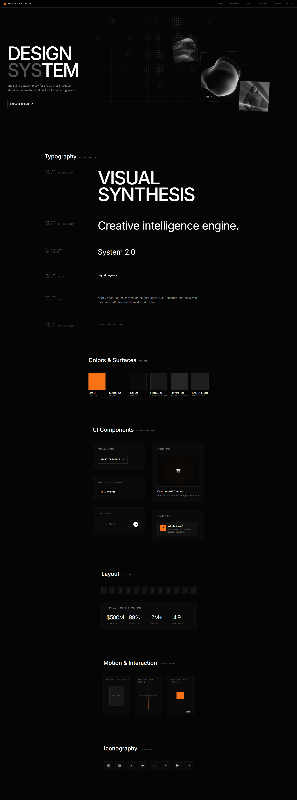
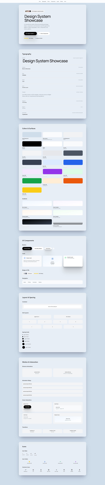
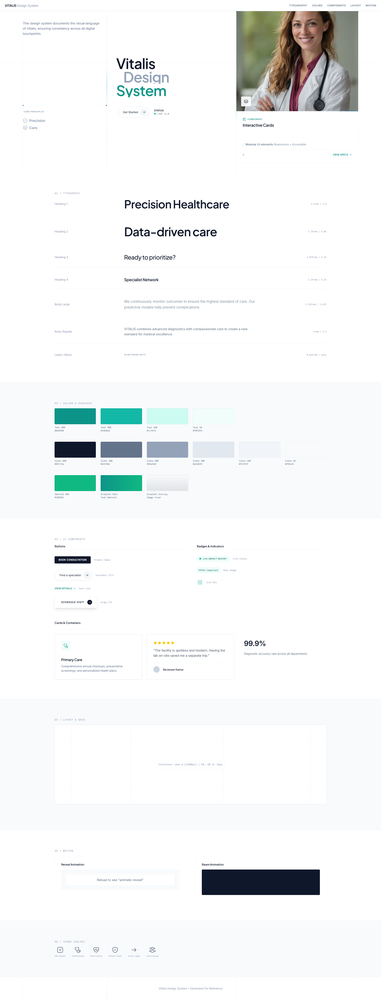

# Como Funciona o Backend (LayoutGenome)

Este documento detalha o funcionamento do backend do projeto, as ferramentas utilizadas e o fluxo de extração e geração de DNA de layouts (o Design System).

## 🛠 Ferramentas e Bibliotecas Utilizadas

O backend foi construído em **Python 3** utilizando o framework **Flask** para expor uma API RESTful rápida e modular. As principais bibliotecas utilizadas são:

- **Flask**: Criação do servidor web, rotas da API (como `/api/download-site` e `/api/generate-designer-system`) e renderização de templates base.
- **BeautifulSoup4**: Fundamental para a manipulação do DOM. Ele analisa (_parsing_) a estrutura do `index.html` recebido, extraindo tokens de cor, elementos tipográficos e limpando tags nocivas (como `<script>`). É também chave para montar a versão estática de _fallback_.
- **Playwright** _(via `downloader.py`)_: Ferramenta moderna de automação de browser, usada para fazer o download completo e fidedigno do site alvo, recriando a hierarquia perfeita de dependências locais (imagens, fontes, css, js).
- **Requests / urllib3**: Para lidar com requisições HTTP internas e despachar prompts para os provedores de Inteligência Artificial via APIs REST.
- **python-dotenv**: Gerenciamento de chaves secretas (`OPENAI_API_KEY`, tokens) num ecossistema seguro e externo ao código.
- **Gunicorn**: Usado como servidor WSGI pronto para ambiente de produção, lidando simultaneamente com múltiplas conexões de rede.

## Como o Script Funciona (`app.py`)

A arquitetura do `app.py` é multitarefa e desenhada para funcionar fluidamente no background, não bloqueando a interface do usuário:

1. **Filas Assíncronas para Download**
   Ao acionar a rota `/api/download-site`, o script não trava no processamento pesado. Ele cria um Job e dispara uma `thread` separada chamando o objeto `WebsiteDownloader`. Isso raspa página, CSS, JS e agrupa tudo num `.zip` final.
2. **Monitoramento via Server-Sent Events (SSE)**
   O front-end se conecta no `/api/download-events/`. Usando a estrutura de _Queue_ interna, o Python vai transmitindo cada "passo" (logs como _"Arquivo X baixado"_, _"Compactando"_) de forma imediata. O usuário tem um _feedback_ instantâneo.
3. **Extração de Design e Integração da IA**
   Na rota `/api/generate-designer-system`, o payload esperado é o conteúdo bruto (`INDEX_HTML`) da página. O primeiro passo do código é proteger o servidor (`_validate_index_html`) checando o tamanho máximo e se é um HTML formatado.
4. **Cadeia Rotativa de IA (Chain Fallback)**
   Esta é a cereja do bolo. O código monta uma cadeia de provedores (OpenRouter → Google AI Studio → OpenAI). O prompt tenta executar no primeiro; se falhar ou estiver sem créditos, passa perfeitamente para o próximo de forma transparente.
5. **O "Fallback" Local (Heurístico)**
   Se todas as requisições de IA falharem (sem internet ou API esgotada), o Python aciona `_build_local_designer_system`. Esse método entra no DOM original com o BeautifulSoup e tenta injetar as cores extraídas à força bruta (pesquisando `--variables` no CSS ou _tags_ em HTML), criando um design-system puramente orgânico, sem depender de IA externa.

## O Prompt de Inteligência Artificial

A mágica generativa da IA repousa principalmente na constante `DESIGNER_SYSTEM_INSTRUCTION` definida em `app.py`:

```text
You are a Design System Showcase Builder.

You are given SITE_URL and INDEX_HTML.

Your task is to create one new intermediate HTML file that acts as a living design
system + pattern library for this exact design.

Generate one single file called: design-system.html and place it in the same folder of
the html file.

This file must preserve the exact look & behavior of the reference design by
reusing the original HTML, CSS classes, animations, keyframes, transitions,
effects, and layout patterns - not approximations.

[...]
```

### Por Que Esse Prompt é Poderoso?

1. **Restrição Absoluta ao Original**: O prompt ataca diretamente a tendência ("alucinações") que as IAs têm de "inventar design". Com trechos fortes e imperativos (`HARD RULES (NON-NEGOTIABLE)`, `Do not redesign or invent new styles`), ele encarcera o modelo no HTML inicial. Ele obriga o reaproveitamento de classes CSS exatas.
2. **Estrutura de Resultados Pronta**: Diferente de pedidos abertos, esse prompt literalmente esbraveja como o _layout_ deve retornar ("Primeira seção um Clone de Hero, e depois a Tabela Tipográfica..."), evitando ter que programar validação visual no código Python. O DOM gerado pela IA já vem modularmente perfeito.

### Apenas "Passível de Ser Refinado"

Embora esmagador em resultado, melhorias podem ocorrer:

- **Custo e Janela de Contexto**: Passar todo o layout original pro Prompt queima milhares de _tokens_. Se num futuro um nó extrair partes úteis via script clássico _antes_ de mandar para IA (vetorização ou "tree-sitter" de HTML), o modelo processaria em segundos e o custo seria fracionado.
- **Rigor na Saída (```html JSON)**: Adicionar "Few-Shot Injection" — que é basicamente enviar dois exemplos curtinhos de como o JSON de saída se parece — estabiliza ainda mais respostas de modelos lentos como o Gemini/Gemma, cimentando o formato de arquivo sem precisar do corretivo `.replace("```html")` presente em `app.py`.

## Resultados Impressionantes

Quando munida de um modelo de Inteligência Artificial generativo forte (GPT-5.1, Claude 4.5 Sonnet ou Gemini 3.1), o processo que levaria semanas para um front-end (documentar escalas hierárquicas, tipografia, paletas de botões originais com hover) se compactam em um arquivo extraído impecavelmente. O "estilo" nativo ganha vida própria.

Veja os _resultados da aplicação_ processando sites reais. Imagens geradas a partir da estrutura extraída com sucesso:

**Resultado - Exemplo 1**


**Resultado - Exemplo 2**


**Resultado - Exemplo 3**

